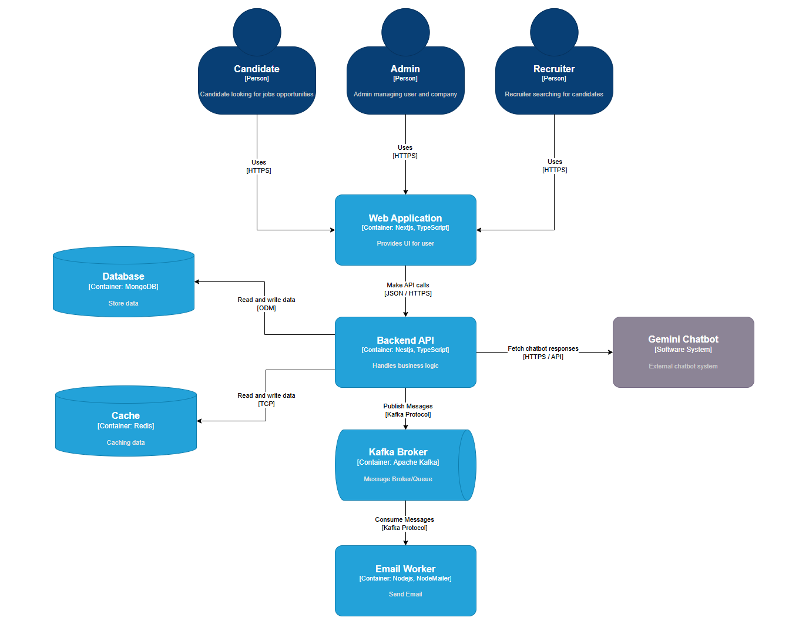

# Jobs Portal
## Overview
My job portal website is a dynamic platform designed to connect job seekers and employers efficiently. Whether you're a fresh graduate looking for your first job, a professional seeking a career change, or a company aiming to find top talent, our platform provides tailored solutions to meet your needs.

With advanced features like AI-powered chatbots, seamless resume management, and automated email notifications, we aim to create a user-friendly and rewarding experience for all users.
## Features
### Admin
- Manage companies and users on the website.
- Oversee platform performance and ensure smooth operations.
### Company Admin
- Manage job postings efficiently.
- Manage hr in company.
### Hr
- Manage job postings efficiently.
- View, filter, and review candidate resumes directly on the platform.
### User
- Find Jobs: Search for job opportunities with advanced filters for industry, location, and salary.
- Chat with Gemini Chatbot: Get personalized assistance, career advice, and job recommendations via AI-powered chatbot.
- Apply with Resume: Easily apply for jobs by submitting your resume online.
- Resume Management: Upload, update, and organize your resumes within your profile.
- Email Notifications: Receive automated updates on your application status.
## Demo

## Diagram
### C1: System Context Diagram

### C2: Container Diagram
